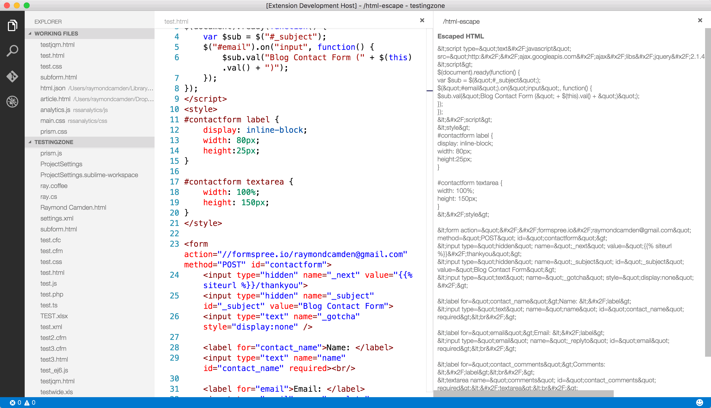

# HTML Escape Extension

This is a Visual Studio Code version of my older Brackets extension. It simply converts HTML (and CSS, JS) into web-ready text that can be used in a blog entry. So for example, a &lt; character will become &amp;lt;. 

This extension is a modified version of a sample created by Erich Gamma of the Visual Studio team. You
can find his sample here: 

https://github.com/Microsoft/vscode-extension-samples/tree/master/textdocumentprovider-sample

I want to give him, and the rest of the VSC team, big thanks for both adding the feature required
to make this extension work and for building a sample I could use to build this. (To be clear, 95%
of the code here is his - I just modified what I need to!)

To use, simply open a file and run `Show Escaped HTML`. If no text is selected, it will convert 
the entire document.

## License
[MIT](LICENSE)

# Updates
0.0.4 I switched the code to copy/mimic this MS example (https://github.com/Microsoft/vscode-extension-samples/tree/master/previewhtml-sample) and it seems to have fixed the copy/paste issue. One problem I have now though is that I can't get the textarea to be 100% big. I had to pick a size and just hope it works out ok. I also don't honestly know what a few lines of this code does. :)

0.0.3 I switched the display to use a textarea. This makes it - hopefully - a bit easier to get the code. It also helps preserve tabs. Unfortunately, you can't CTRL+A in the textarea. Not sure why. 

